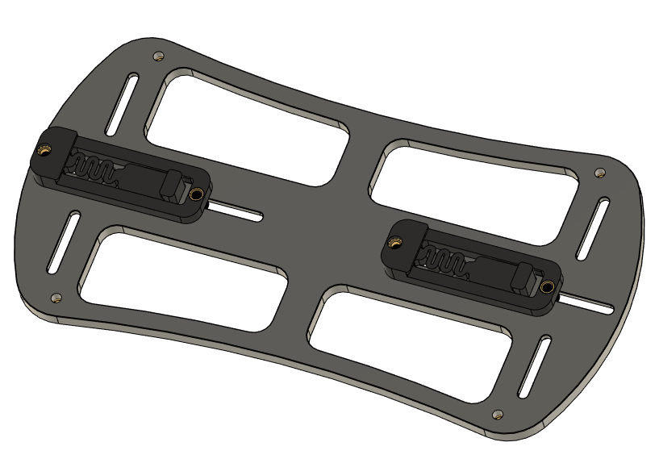
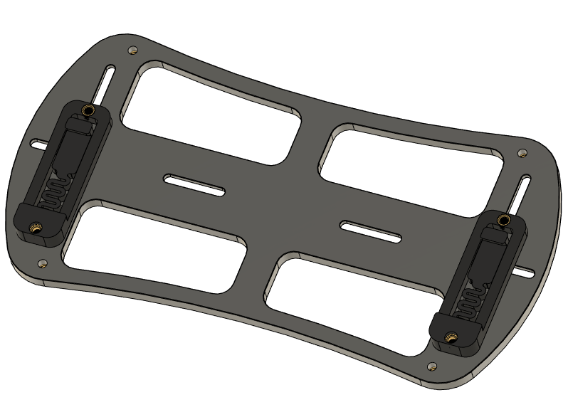

# V2_Octopus_Mount
A mount for the BTT Octopus
This mount is intented for the BTT Octopus board and allows it to be mounted in a Voron V2 on a single din rail or across two din rails.

Adjustability has been added that allow the din rail clamps to slide so you can position the board where you want it.

## Images

## STLs and assembly
din_rail_clamp_x2.stl - this is a modified version of the RS-25 clamp with inserts added
octopus_base.stl

## CAD
Fusion 360 and step file included